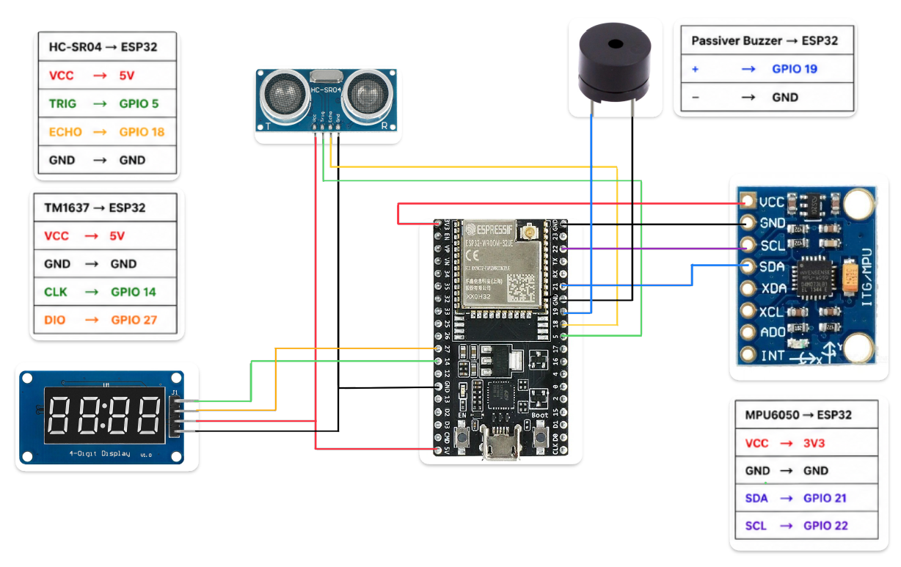
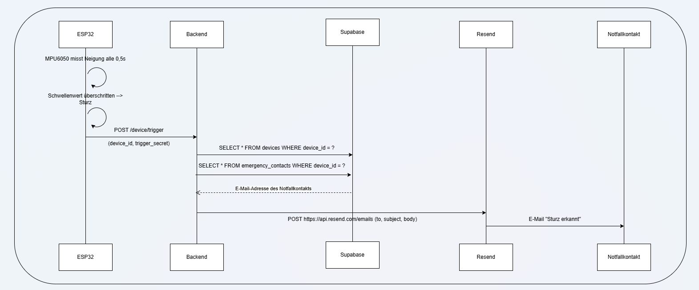

# Dokumentation: Rollstuhl-Sturzerkennung

## 1. Projektübersicht

| Feld | Inhalt |
| :--- | :--- |
| **Team** | Tim, Henrik, Johann |
| **Vorgehensmodell** | Wasserfallmodell |
| **Problemstellung** | Verbesserung der Sicherheit von Rollstuhlfahrer*innen bei schlechten Lichtverhältnissen |
| **Zielgruppe** | Rollstuhlfahrer*innen |

### 1.1 Rollenverteilung
| Person | Rolle              | Aufgaben                                                                                              |
|:-------|:-------------------|:------------------------------------------------------------------------------------------------------|
| Tim    | Softwareentwickler | Backend (Spring Boot, REST-API), Frontend, Datenbankanbindung (Supabase), E-Mail-Integration (Resend) |
| Henrik | Hardwareentwickler | Verkabelung, Schaltplanentwurf, Entwicklung eines Gehäuses                                            |
| Johann | Hardwareentwickler | Sensorintegration (HC-SR04, MPU6050), Komponententests, Buzzer-Logik auf dem ESP32                    |

### Zielsetzung

Rollstuhlfahrer*innen sind in schlecht beleuchteten Umgebungen einem erhöhten Sturzrisiko ausgesetzt, da Hindernisse spät oder gar nicht wahrgenommen werden. Dieses Projekt entwickelt ein eingebettetes System, das Hindernisse frühzeitig erkennt, den Nutzer akustisch warnt und im Falle eines Sturzes automatisch eine Benachrichtigung an eine hinterlegte Kontaktperson sendet.

---

## 2. Projektplanung

### 2.1 Anforderungen (Must / Should / Could)

| Priorität | Anforderung | Status |
| :--- | :--- | :--- |
| Must-have | Abstandsmessung mit Warntönen ab einer definierten Entfernung | ✅ Umgesetzt |
| Must-have | Neigungssensor mit automatischer Benachrichtigung bei Überschreitung eines Schwellenwerts | ✅ Umgesetzt |
| Must-have | Backend, das bei einem Sturzereignis eine E-Mail an eine Kontaktperson versendet | ✅ Umgesetzt |
| Should-have | Login-Funktion im Frontend | ✅ Umgesetzt |
| Should-have | Verwaltung von Notfallkontaktinformationen im Frontend | ✅ Umgesetzt |
| Should-have | Verwaltung eigener Profilinformationen im Frontend | ✅ Umgesetzt |
| Could-have | Kopplungslogik zur dynamischen Verknüpfung eines Geräts mit einem Nutzerkonto | ✅ Umgesetzt |
| Could-have | Anbringung eines 3D-gedruckten Gehäuses unter der Fußstütze | ❌ Verworfen |

### 2.2 Zeitplanung

- **Gesamtaufwand:** ca. 27 Stunden

| Phase              | Meilenstein                                                                               | tatsächlicher Aufwand |
|:-------------------|:------------------------------------------------------------------------------------------|:----------------------|
| 1: Entwurf         | Entwurf der Architektur, Komponentenauswahl                                               | 2 Std.            |
| 2: Implementierung | Hardware-Setup: Verkabelung, Buzzer-Logik auf dem ESP32                                   | 7 Std.            |
|                    | Backend: REST-API mit Spring Boot, Datenbankanbindung (Supabase), E-Mail-Versand (Resend) | 7 Std.            |
|                    | Frontend: Login, Profilpflege, Notfallkontaktverwaltung, Kopplungslogik                   | 8 Std.            |
| 3: Testen          | Integration & Test: End-to-End-Testdurchlauf, Fehlerbehebung, Dokumentation               | 3 Std.            |
| **Gesamt**         |                                                                                           | **27 Std.**       |

---

## 3. Technisches Design (CPS)

### 3.1 Hardware & Sensorik

**Eingesetzte Komponenten:**

| Komponente | Funktion |
| :--- | :--- |
| ESP32 | Mikrocontroller, zentrale Steuereinheit |
| MPU6050 | Inertialmesseinheit zur Neigungserkennung |
| HC-SR04 | Ultraschall-Distanzsensor |
| Passiver Buzzer | Akustische Warnanzeige |
| TM1637 | 7-Segment-Anzeige |
| Powerbank | Mobile Stromversorgung |

**Messwerterfassung:**

- Der **HC-SR04** misst sekündlich den Abstand zu Hindernissen (Reichweite bis 2 m). Unterschreitet der gemessene Abstand 50 cm, gibt der Buzzer einen Warnton aus, der mit abnehmendem Abstand lauter wird.
- Der **MPU6050** erfasst ebenfalls sekündlich die Neigung des Rollstuhls. Überschreitet die Neigung einen definierten Schwellenwert, wird eine Sturzbenachrichtigung ausgelöst.

**Schaltplan:**



> *Schaltplan als Export aus Fritzing oder vergleichbarem Tool einfügen.*

---

### 3.2 Software & Kommunikation

**Startlogik & Kopplung:**


**Notfalllogik:**


**Kommunikation:**

Die gesamte Kommunikation zwischen den Systemkomponenten erfolgt verschlüsselt über **HTTPS**.

```cpp
@PostMapping("/device/trigger")
    public ResponseEntity<?> triggerDeviceEmergency(@RequestBody TriggerRequest request) {

        if (!request.triggerSecret().equals(triggerSecret)) return ResponseEntity.status(HttpStatus.FORBIDDEN).body(Map.of("error", "Nicht autorisiert"));

        try {
            Optional<Device> existing = supabaseService.getDeviceById(request.deviceId());

            if (existing.isEmpty()) return ResponseEntity.status(404).body(Map.of("error", "Gerät nicht bekannt"));

            Device device = existing.get();
            if (!device.status().equals(Status.PAIRED) || device.userId() == null || device.userId().isEmpty()) return ResponseEntity.badRequest().body(Map.of("error", "Device ist nicht paired"));

            EmergencyContact contact = supabaseService.getEmergencyContact(device.userId(), triggerSecret);
            UserInformation userInformation = supabaseService.getUserInformation(device.userId(), triggerSecret);

            if (contact == null || userInformation == null) {
                return ResponseEntity.badRequest().body(Map.of("error", "Kein Notfallkontakt/Userinformation hinterlegt"));
            }

            /// E-Mail senden
            emailService.sendEmergencyNotification(
                    contact,
                    userInformation.getFirstName() + " " + userInformation.getLastName()
            );

            return ResponseEntity.ok(Map.of(
                    "message", "Notfall-Benachrichtigung versendet",
                    "recipient", contact.getContactEmail()
            ));

        } catch (Exception e) {
            return ResponseEntity.status(500).body(Map.of("error", "Fehler beim Trigger: " + e.getMessage()));
        }
    }
```

**Datenhaltung:**

Die anfallenden Daten werden über den kostenlosen Tier des Dienstleisters **Supabase** in einer PostgreSQL-Datenbank gespeichert.

**Sequenzdiagramm – Sturzbenachrichtigung:**

Das folgende Sequenzdiagramm zeigt den vollständigen Ablauf vom Sturzereignis bis zur E-Mail-Benachrichtigung:




**Entity-Relationship-Modell (ERM):**


---

## 4. Rechtliches & Nachhaltigkeit

### 4.1 Datenschutz

**Gespeicherte Nutzerdaten (Accountinhaber):**
- E-Mail-Adresse (Login)
- Passwort (verschlüsselt gespeichert)
- Vorname und Nachname

**Gespeicherte Daten des Notfallkontakts:**
- Vorname und Nachname
- E-Mail-Adresse
- Telefonnummer *(optional; für eine spätere Erweiterung auf SMS- oder WhatsApp-Benachrichtigungen vorgesehen)*

**Bekannte datenschutzrechtliche Mängel:**

1. **Einwilligung des Notfallkontakts:** Die Speicherung personenbezogener Daten eines Notfallkontakts setzt dessen ausdrückliche Einwilligung voraus (Art. 6 DSGVO). Eine entsprechende Bestätigungslogik wurde aus Zeitgründen nicht implementiert und muss in einer Folgeversion nachgerüstet werden.

2. **Datensparsamkeit (Telefonnummer):** Die Speicherung der Telefonnummer ist für die aktuelle Funktionalität nicht erforderlich und verstößt damit gegen das Prinzip der Datensparsamkeit (Art. 5 Abs. 1 lit. c DSGVO). Das Feld wurde nach Implementierung identifiziert, konnte jedoch aus Zeitgründen nicht mehr entfernt werden.

### 4.2 Urheberrecht

**Eingesetzte Open-Source-Bibliotheken und Frameworks:**

| Bibliothek / Framework | Lizenz |
| :--- | :--- |
| Spring Boot (Web, Security) | Apache License 2.0 |
| OkHttp 4.12.0 | Apache License 2.0 |
| Gson | Apache License 2.0 |
| Supabase Java Client | MIT License |
| Lombok | MIT License |
| Tailwind CSS | MIT License |

**Externe Dienste:**

| Dienst | Verwendungszweck |
| :--- | :--- |
| Supabase | Datenbank-Hosting (PostgreSQL) |
| Render | Deployment und Hosting des Backends |
| Resend | API-basierter E-Mail-Versand |

### 4.3 Nachhaltigkeit

**Hardware:**

| Komponente | Nachhaltigkeitsbewertung |
| :--- | :--- |
| ESP32 | Sehr energieeffizient durch niedrigen Ruhestromverbrauch |
| MPU6050 | Geringer Stromverbrauch, keine beweglichen Teile → hohe Lebensdauer |
| HC-SR04 | Robust, jedoch anfällig gegenüber Feuchtigkeit |
| Passiver Buzzer | Minimaler Stromverbrauch, einfache Bauweise → hohe Lebensdauer |
| TM1637 | LED-basierte Anzeige mit langer Lebensdauer, moderater Verbrauch |
| Powerbank | Wiederaufladbarer Akku als Stromquelle → kein Einwegbatterien-Verbrauch, flexibel einsetzbar und austauschbar |

Die Wahl einer **Powerbank als mobile Stromversorgung** ist bewusst auf Nachhaltigkeit ausgerichtet: Im Vergleich zu Einwegbatterien ist sie wiederaufladbar, langlebig und lässt sich bei Defekt einfach ersetzen, ohne die gesamte Hardware austauschen zu müssen.

**Software:**

- Geringe Datenlast → niedriger Speicher- und Energieverbrauch
- Kurze Gültigkeitsdauer von Kopplungssessions (max. 2 Minuten) → keine unnötige Ressourcenbindung
- Alle Backend-Endpunkte sind ereignisbasiert → keine dauerhaften Hintergrundprozesse
  - *Ausnahme:* Das Gerät fragt den Kopplungscode alle 5 Sekunden ab, was auf eine Gesamtdauer von maximal 2 Minuten begrenzt ist.

---

## 5. Evaluation & Reflexion

### 5.1 Testergebnisse

| Funktion | Ergebnis |
| :--- | :--- |
| Abstandsmessung (HC-SR04) | ✅ Funktioniert; Buzzer gibt ab 50 cm einen Warnton aus, der mit sinkendem Abstand lauter wird |
| Neigungsmessung (MPU6050) | ✅ Neigung wird korrekt erfasst und ausgewertet |
| Sturzbenachrichtigung per E-Mail | ✅ Backend sendet bei Überschreitung des Neigungsschwellenwerts eine E-Mail an den hinterlegten Notfallkontakt |
| Frontend – Notfallkontaktverwaltung | ✅ Daten können angelegt und bearbeitet werden |
| Frontend – Profilverwaltung | ✅ Eigene Daten können gepflegt werden |
| Kopplungslogik | ✅ Gerät lässt sich zuverlässig mit einem Nutzerkonto verknüpfen |

### 5.2 Erkenntnisse

- Die Umsetzung im Wasserfallmodell hat sich für ein Projekt dieser Größe bewährt, da die Anforderungen von Beginn an klar definiert waren. Bei häufigen Änderungen wäre ein agiles Vorgehen sinnvoller gewesen.
- Die Entscheidung, Supabase als Datenbankdienst zu nutzen, hat die Entwicklung deutlich beschleunigt, schränkt jedoch die Kontrolle über die Datenhaltung ein.
- Datenschutzrechtliche Aspekte sollten von Beginn an in die Planung einbezogen werden, um nachträgliche Korrekturen zu vermeiden.
- Die Tonsignalisierung mit variierender Lautstärke hat sich als intuitiv und wirksam erwiesen.

### 5.3 Ausblick (Version 2.0)

Folgende Erweiterungen sind für eine zukünftige Version denkbar:

- **DSGVO-konforme Einwilligungslösung:** Notfallkontakte sollen aktiv zustimmen müssen, bevor ihre Daten gespeichert werden.
- **SMS- und WhatsApp-Benachrichtigung:** Nutzung der bereits gespeicherten Telefonnummer für alternative Benachrichtigungskanäle.
- **3D-gedrucktes Gehäuse:** Wetterfestes Gehäuse zur Montage unter der Fußstütze des Rollstuhls.
- **Verbesserte Sturzerkennung:** Auswertung mehrerer Achsen und Beschleunigungsdaten des MPU6050 für eine zuverlässigere Sturzklassifikation (z. B. Differenzierung zwischen absichtlichem Neigen und echtem Sturz).
- **Mobile App:** Entwicklung einer Companion-App zur komfortableren Konfiguration und Alarmierung in Echtzeit.
- **Akku-Monitoring:** Anzeige des Ladestands der Powerbank im Frontend, um unerwartete Ausfälle zu verhindern.