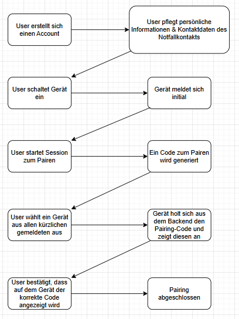
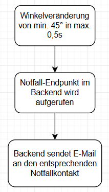
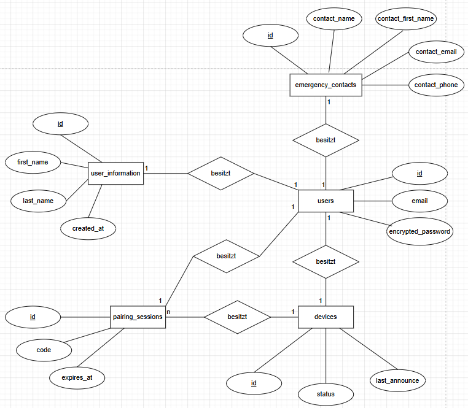

# Dokumentation: Rollstuhl Sturzerkennung

## 1. Projektübersicht
* **Team:** Tim, Henrik, Johann
* **Organisationsmethode:** Wasserfall
* **Problemstellung:** Sicherheit von Rollstuhlfahrern bei schlechten Lichtverhältnissen verbessern
* **Zielgruppe:** Rollstuhlfahrer*innen

## 2. Projektplanung
### 2.1 Anforderungen (Must/Should/Could)
| Priorität | Anforderung                                                                                      | Status |
| :--- |:---| :--- |
| Must-have | Abstandmessung mit Warntönen ab einer      bestimmten Entfernung                                 | Umgesetzt
| Must-have | Neigungsensor mit automatischer Benachrichtigung, falls eine bestimmte Neigung überschritten ist | Umgesetzt
| Must-have | Backend, welches eine E-Mail an eine Kontaktperson schicken kann                                 | Umgesetzt
| Should-have | Login im Frontend                                                                                | Umgesetzt
| Should-have | Pflege von Notfallkontaktinformationen im Frontend                                               | Umgesetzt
| Should-have | Pflege von eigenen Informationen im Frontend                                                     | Umgesetzt
| Chould-have | Kopplungslogik, mit der ein Gerät dynamisch mit einem Useraccount verbunden werden kann          | Umgesetzt
| Could-have | Anbringung des 3D-gedruckten Gehäuses unter der Fußleiste                                        | Verworfen

### 2.2 Zeitplanung
* **Gesamtstunden:** 27std.
* **Wichtigste Meilensteine:**
    1. Fertigstellung des Hardware-Setups mit allen nötigen Komponenten
    2. Fertigstellung des Frontends mit Login für beliebig viele Nutzer
    3. Fertigstellung des Backends mitsamt aller Endpunkte
    4. Erster erfolgreicher Testdurchlauf

## 3. Technisches Design (CPS)
### 3.1 Hardware & Sensorik
* **Komponenten:** Esp32, MPU6050, HC-SR04, Passiver Buzzer, TM1637, Powerbank
* **Messwerterfassung:** Mit dem HC-SR04 wird sekündlich ein Abstand, bis zu 2m, gemessen, ab einer Entfernung von 50cm wird mit dem Buzzer ein Ton ausgegeben. Neben dem Abstand wird auch die Neigung sekündlich mit dem MPU6050 gemessen.
* **Schaltplan:** `![Schaltplan hier einfügen/verlinken]`

### 3.2 Software & Kommunikation
* **Logik (Start + Koppeln):**

  
* **Logik (Notfall):**

  
* **Kommunikationswege:** jegliche Kommunikation zwischen den Partnern läuft über HTTPS
* **Datenverarbeitung:** Die Daten werden über das freie Angebot von "Supabase" in einer eigenen Datenbank abgespeichert
  * Zugrundeliegendes ERM:

    
## 4. Rechtliches & Nachhaltigkeit
### 4.1 Datenschutz & Urheberrecht
* **Datenschutz:**
  * Es werden von der Person, die den Account anlegt folgende Daten gespeichert:
    * E-Mail-Adresse (für den Login)
    * Passwort (verschlüsselt) (für den Login)
    * Vorname
    * Nachname
  * Vom Notfallkontakt werden folgende Daten gespeichert:
    * Vorname
    * Nachname
    * E-Mail-Adresse
    * Telefonnummer (optional, wäre für Erweiterung auf SMS, WhatsApp wichtig)
  * Uns ist bewusst, dass 
    * die Person, die sich das System installiert und einen Account anlegt, nicht ohne Weiteres 
    die Daten des Notfallkontakts abspeichern darf, hierbei wäre eine Bestätigung des Notfallkontakts erforderlich, der ausdrücklich zustimmt, dass seine Daten dort verwendet werden dürfen
    
      → wegen mangelnder Zeit nicht beachtet
    * die Telefonnummer des Notfallkontakts hier nicht abgespeichert werden dürfte, da diese nicht notwendig ist für die Funktion
      
      → dies ist uns nach Implementierung aufgefallen und aus Zeitgründen haben wir es nicht mehr entfernt
* **Urheberrecht:** 
  * **Open-Source-Bibliotheken und Frameworks:**
    * Spring Boot (Web, Security) – Apache License 2.0
    * OkHttp 4.12.0 – Apache License 2.0
    * Gson – Apache License 2.0
    * Supabase Java Client – MIT License
    * Lombok
    * Tailwind CSS – MIT License

* **Externe Dienste:**
  * Supabase – Datenbank-Hosting
  * Render – Deployment und Hosting
  * Resend – E-Mail-Versand API

### 4.2 Nachhaltigkeit
* **Hardware:** 
  * ESP32:
    * sehr energieeffizient durch geringen Stromverbrauch
  * MPU6050:
    * geringer Stromverbrauch
    * keine beweglichen Teile → langlebig
  * HC-SR04:
    * relativ langlebig, jedoch gegenüber Feuchtigkeit anfällig
  * Passiver Buzzer
    * sehr geringer Stromverbrauch
    * einfache elektronische Bauweise → hohe Lebensdauer
  * TM1637:
    * LEDS besitzen eine lange Lebensdauer
    * Stromverbrauch ist moderat
  * **Software:**
    * Geringe Datenlast → geringer Speicherverbrauch + Ladezeit
    * Kurze Zeitspanne für Kopplung → Pairing-Sessions laufen schnell aus und werden nicht weiter verabeitet
    * Alle Endpunkte sind ereignisbasiert → keine dauerhaften Hintergrundprozesse
      
      → Ausnahme: Gerät fragt Kopplungscode alle 5s an, was aber auf eine maximale Gesamtdauer von 2min begrenzt ist

## 5. Evaluation & Reflexion
* **Testergebnisse:** Abstand wird mit dem HC-SR04 gemessen, ab 50cm wird mit dem Passiven Buzzer ein Warnton ausgegeben. Der Ton wird lauter je geringer der Abstand wird. Die Neigung mit dem MPU6050 wird gemessen. Mit der grafischen Oberfläche können Notfallkontakte gespeichert werden und getriggert werden. 
* **Erkenntnisse:** [Was haben wir im Prozess gelernt?]
* **Ausblick:** [Was könnte in einer Version 2.0 verbessert werden?]

---

### Tipps für die Schüler zur Arbeit mit Markdown:
* **Bilder:** Legt eure Diagramme (Export aus Fritzing, Draw.io etc.) in einen Ordner `img` und verlinkt sie mit ``.
* **Code:** Kurze Code-Snippets könnt ihr direkt einbinden:
    ```cpp
    if (sensorValue > threshold) {
      triggerAction();
    }
    ```
* **Tabellen:** Achtet auf die Trennstriche (`|` und `-`), damit die Tabellen korrekt gerendert werden.